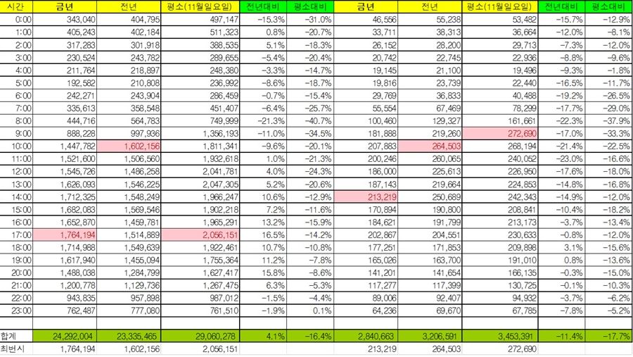

# 메시지 통계 시스템

# 프로그램 소개

**메시지 통계 시스템**은 Azure Data Explorer(ADX)에 저장된 일별·기업별 발송량을 **자연어로 질의**하고, **기준일 비교+예측**, **월/연 추이 분석**까지 한 번에 보여주는 Streamlit 웹앱입니다. ADX의 시계열 기능과 Altair 시각화, Azure OpenAI 요약을 결합해 **데이터→인사이트**를 빠르게 제공합니다.

---

# 요구사항

**메시지 통계 시스템**은 운영 통계에 대한 추이 분석, 이상 패턴, 예상 물량에 대해서 현재 엑셀 기준으로 수동으로 분석 및 측정을 하고 있어, 휴먼에러에 의한 신뢰도 하락 및 결과 불확실성이 존재합니다. 통계 분석 관련 AI를 활용하여 작업 효율성 강화 및 분석 정확도를 높이는 것이 목표를 하고 있습니다.



---

# 사용한 리소스


# 아키텍처 한눈에 보기

```
[사용자 브라우저]
      │ (Streamlit UI)
      ▼
[UI 레이어: app.py]
  ├─ Sidebar 상태 관리(모드/회사/연·월/기준일, KQL보기)
  ├─ 질문 템플릿 & 회사 추출(apply_aliases)
  ├─ 모드별 실행 라우팅
  └─ 차트/테이블 렌더(Altair/Streamlit)

      │  (core 호출)
      ▼
[Core 모듈: ask_adx_nl]
  ├─ KustoClient 생성(build_kusto_client)
  ├─ 회사 alias/정규화(apply_aliases, _canon_company)
  ├─ 자연어→KQL(question_to_kql)
  ├─ 분석 KQL 생성(build_analysis_kqls)
  ├─ 기준일 비교 KQL(build_point_compare_kql)
  ├─ 7일 예측 KQL(build_next7_forecast_kql)
  ├─ ADX 실행(run_kql, run_kql_all)
  └─ 결과 요약(analyze_point_and_forecast / analyze_and_comment → aoai_summarize)

      │ (KQL 실행)
      ▼
[Azure Data Explorer (ADX)]
  ├─ Stats 테이블(회사, ts, count…)
  └─ make-series / series_decompose / forecast / 집계

      │ (요약 요청)
      ▼
[Azure OpenAI]
  └─ 한국어 Bullet 인사이트 생성
```

---

# 핵심 기능

- **단순 조회**: 자연어→KQL 변환 후 단일 결과 표 출력.
- **기준일 비교+예측**: 기준일의 전일/1주전 동일요일/1개월전 동일일 비교(증감률) + **직전 180일 기반 7일 예측**(모델 부적합 시 **최근7일 이동평균 폴백**), AI 요약 코멘트.
- **월/연 추이 분석**: 연/월/요일/시간대 분포 및 Top/Low 일자 표 + 비교 차트 탭(일/월/요일/시간대) + 요약 코멘트.

---

[kiaselwebapp-0916.azurewebsites.net](http://kiaselwebapp-0916.azurewebsites.net/)

# 테스트 (데이터가 25년 01~08월 존재)

1. (단순조회) 2025.05 구글의 사용량 궁금해. 일통계로 보여줘
2. (단순조회) 2025년 5월 구글 사용량이 궁금해, 월통계로 보여줘
3. (단순조회) 2025년 TOP 10 인입 월과 일자, 시간대 알려줘, 
4. (단순조회) 2025년 TOP 10 인입 월과 일자, 시간대 알려줘, 건수도 보여줘 
5. (기준일 기준 비교+예측) 회사 필수, 일자선택 필수 → google 2025-06-18 기준 전일/1주전/1개월전 비교하고 다음 7일 예측도 보여줘! (오류가 좀 있음..)
6. (월/연 추이분석) meta 2025년 5월 추이 분석
7. (월/연 추이분석) google 회사의 2025.05월 일별 사용량 알려줘
8. (월/연 추이분석) apple 2025년 추이 분석
9. (단순조회) 메타 05시대 사용량 보여줘
10. (단순조회) 10시대에 가장 높은 사용량은 언제인지, 어떤 회사인지 상위 10개 보여줘